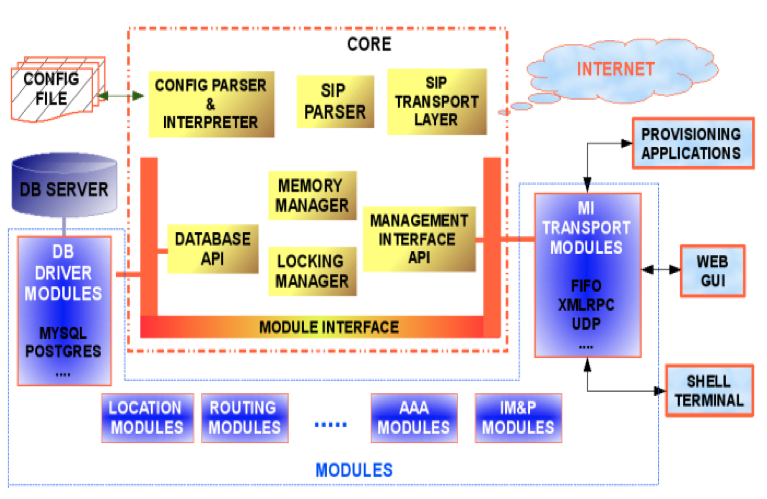
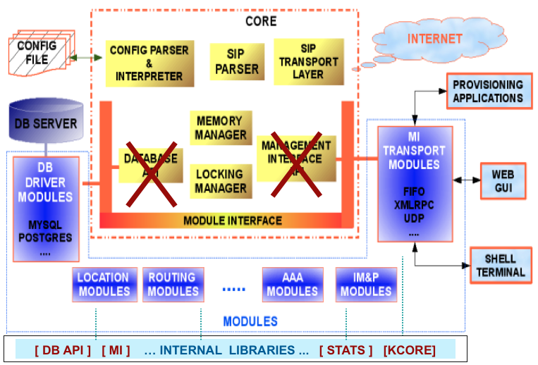

# Kamailio Architecture #

Kamailio has a modular architecture. As a big picture, there are two main categories:

* **the core** - It is the component that provides the low-level functionalities for Kamailio.
Starting with version 3.0.0, Kamailio core includes so called
_internal libraries_. They collect code shared by several modules
but which does not have a general purpose to be part of main core.

* **the modules** - are the components that provides the most
of the functionalities that make Kamailio powerful in real world deployments.

The architecture for Kkamailio v1.5.x (or older) is shown in the next figure.
## Kamailio 1.x Architecture ##
		

The architecture for Kamailio v3.0.x (or newer) was refactored, permitting 
to have code shared by several modules stored in internal libraries. Some of
the core components in v1.x being relocated as an internal library. The new
architecture for v3.0.x compared with the one from v1.x is shown in the next figure.

## Kamailio 3.x Architecture ##

## Kamailio Core ##

The core includes:

* memory manager
* SIP message parser
* locking system
* DNS and transport layer management (UDP, TCP, TLS, SCTP)
* configuration file parser and interpreter
* stateless forwarding
* pseudo-variables and transformations engines
* RPC control interface API
* timer API

The internal libraries include:

* some components from old Kamailio v1.5.x core
* database abstraction layers (DB API v1 and v2)
* statistics engine

## Kamailio Modules ##

There are over 150 modules in the repository at this moment. By loading modules,
you can get functionalities such as:

* registrar and user location management
* accounting, authorization and authentication
* text and regular expression operations
* stateless replying
* stateful processing - SIP transaction management
* SIP dialogs tracking - active calls management
* instant messaging and presence extensions
* RADIUS and LDAP support
* SQL and no-SQL database connectors
* RPC transports
* Enum, GeoIP API and CPL interpreter
* topology hiding and NAT traversal
* load balancing and least cost routing
* asynchronous SIP request processing
* interactive configuration file debugger
* Lua, Perl, Python and Java SIP Servlet extensions

## SIP Message Processing ##
The execution of Kamailio configuration file is triggered when receiving a SIP message from
the network. The processing flow is different for a SIP request or a SIP reply.

## SIP Request Processing ##

## SIP Reply Processing ##

The document contains a chapter dedicated to _Configuration File_ that
explains its structure and the types of routing blocks.
