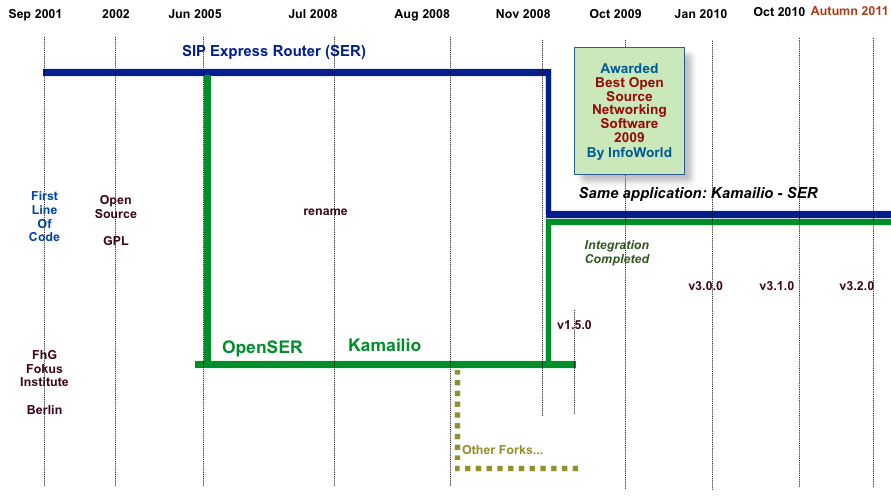

# Introduction #

## Kamailio SIP Server ##
In June 2005, Kamailio was born as a
split from SIP Express Router (aka SER) project of FhG FOKUS Institute, Berlin, Germany.
The newly created project was aiming to create an open development environment to 
build robust and scalable open source SIP server.
Initial name was OpenSER, but due to trademark infringements claims, the project name changed
from OpenSER to Kamailio on July 28, 2008.

The website of the project is [https://wwww.kamailio.org](https://www.kamailio.org).
The source code up to version 1.5.x was hosted on
[sourceforge.net](https://sourceforge.net) SVN repository. Starting with version 3.0.0,
the source code is hosted on [https://github.com/kamailio/kamailio](https://github.com/kamailio/kamailio) GIT repository.

In November 2008, the development teams of Kamailio and SIP Express Router (SER) joined again
their efforts and started to work together to integrate the two SIP server applications. The integration
concluded with release of v3.0.0, which represents a single source code tree for both applications. In
other words, Kamailio and SER are the same application from source code point of view, the difference is
done by the name chosen to build the application and the modules loaded in the default configuration file.

The evolution in time of Kamailio is presented in next figure.

Today Kamailio SIP Server is a reference implementation, featuring hundreds of VoIP services
world wide, being developed by people around the world. It is included in official distributions
of several Linux and BSD flavors.

The number of registered developers and packagers exceeded 90 since the start of the project in 2001.
During the last year, over 30 registered developers contributed code to project.
The level of contributions and the amount of contributors has an important impact on the evolution
of the project. The book tries to ease the understanding of Kamailio from a developer point of view,
giving the kick start knowledge, it does not intend to be a cookbook. Efforts to improve the
documentation in the sources is undertaken and make it ** doxygen **
compliant, making a good developer documentation out of there.

## About the authors ##
*Daniel-Constantin Mierla* is one of the co-founders of
Kamailio SIP Server project. He is involved in VoIP and SIP since beginning of 2002,
at FhG FOKUS Institute, Berlin, Germany, being core developer in the
SIP Express Router project. Currently he is employed by
[ASIPTO](https://www.asipto.com), a Kamailio-focused
company. Daniel is an active Kamailio developer, member of management board, leading
the project.

*Elena-Ramona Modroiu* is one of the co-founders of 
Kamailio SIP Server project. She got involved in VoIP and SIP while working at her
graduation thesis within SIP Express Router (SER) project at FhG FOKUS Institute. She
completed studies at Polytechnic University of Valencia and Siemens Germany, working now at
[ASIPTO](http://www.asipto.com),
being an active developer and member of management board of Kamailio.

The two authored many online tutorials about Kamailio, among them: _KamailioCore Cookbook_, 
_Kamailio Transformations Cookbook_,
_Kamailio Pseudo-Variables Cookbook_,
_Kamailio and Asterisk Integration_,
_Kamailio and FreeSWITCH Integration_,
_SIP Routing in Lua with Kamailio_,
_Secure VoIP with Kamailio_,
_IPv4 - IPv6 VoIP bridging with Kamailio_,
_Kamailio and FreeRADIUS_.

## Important ##

This document is focusing only to Kamailio specific API, has no intention to teach
C programing for Linux and Networking. You, as a reader, should have already the
basic knowledge of C programming.

Do not contact the authors to ask about standard C functions or variables.

There are many references to parts of code in the source tree. You must be familiar
with the directory structure of Kamailio. It is not our intention to explain how
something was implemented, but how to use existing code to extend Kamailio easily.

The source code remains the best reference for developers. In the last time, the comments
around the important functions in Kamailio have been improved and converted to
*doxygen* format. You should double-check the source
code if the prototype of the functions presented in this document are still valid.

Daily updated *doxygen* documentation is available at
[http://rpm.kamailio.org/doxygen/sip-router/branch/master/index.html](http://rpm.kamailio.org/doxygen/sip-router/branch/master/index.html) .
