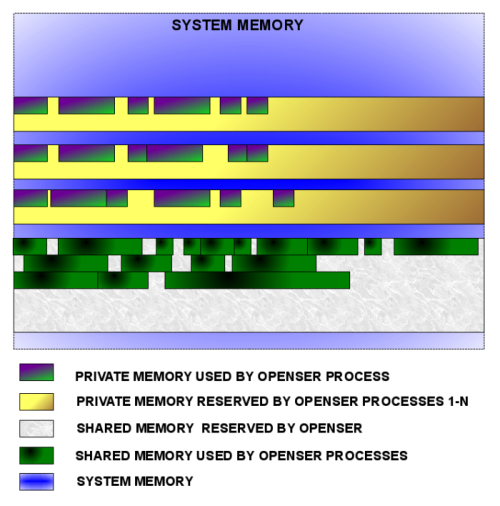

As Kamailio is a multi-process application, the usage of shared memory is
required in many scenarios. The memory manager tries to simplify the work with
shared and private memory, providing a very simple programming interface.
The internal design took in consideration speed optimizations, something
very important for a real-time communication server.

The manager is initialized at start-up, creating the chunks for private and shared
memory. It is important to know that the shared memory is not available during
configuration parsing, that includes the setting of module parameters.

When the own memory manager cannot be used, Kamailio falls back to the SysV shared
memory system.

Shortly, the manager reserves a big chunk of system memory for itself at start-up,
then it allocates parts inside the chunk as visible in the following figure.

# Private Memory #

This type of memory is specific per process, no synchronization is needed to
access structures allocated in it. It should be used for variables that do not
need to be visible in other Kamailio processes or for temporary operations.

To store static values in private memory and have it in all processes without
the need to synchronize for accessing it, you must create it before Kamailio
forks.

To use the private memory manager you have to include the file: **mem/mem.h**.

# pkg_malloc(...) #

Allocates space in private memory.

## Prototype ##
    ...
    void* pkg_malloc(unsigned int size);
    ...

The parameter specifies the size of memory space to be allocated. Returns the pointer to
memory if the the operation succeeds, NULL otherwise.

## Example of usage ##

    ...
    #include "mem/mem.h"
    ...
    char *p;
    p = (char*)pkg_malloc(8*sizeof(char));
    if(p==NULL)
    {
        LM_ERR("cannot allocate pkg memory\n");
        exit;
    }
    ...
# pkg_free(...) #

Free allocated private memory.

## Prototype ##
    ...
    void *pkg_free(void *p);
    ...

The parameter is the pointer to the memory to be freed.

## Example of usage ##
    ...
    #include "mem/mem.h"
    ...
    char *p;
    p = (char*)pkg_malloc(8*sizeof(char));
    if(p==NULL)
    {
        LM_ERR("cannot allocate pkg memory\n");
        exit;
    }
    strcpy(p, "kamailio");
    LM_DBG("string value at %p is [%s]\n", p, p);
    pkg_free(p);
    ...

# pkg_realloc(...)#

Realloc a previously allocated memory chunk. It copies the content of the old
memory chunk to the new one. If the space after the old chunk is free and large enough
to scale to the new size, the Kamailio memory manager will set the size of the old chunk
to the new size, marking properly the memory zone, in this way, the copy operation
is skipped.

## Prototype ##

    ...
    void *pkg_realloc(void *p, unsigned int size);
    ...

The first parameter is the pointer to the memory space that needs to be re-sized. The
second parameter is the new size in bytes. The function return the pointer to the new
memory space, or NULL if an error occurred. Beware that the returned pointer may be
different than the old pointer.

## Example of usage ##

    ...
    #include "mem/mem.h"
    ...
    char *p;
    p = (char*)pkg_malloc(8*sizeof(char));
    if(p==NULL)
    {
        LM_ERR("cannot allocate pkg memory\n");
        exit;
    }
    strcpy(p, "kamailio");
    LM_DBG("string value at %p is [%s]\n", p, p);
    p = (char*)pkg_realloc(p, 16*sizeof(char));
    if(p==NULL)
    {
        LM_ERR("cannot re-allocate pkg memory\n");
        exit;
    }
    strcat(p, " server");
    LM_DBG("string value at %p is [%s]\n", p, p);
    
    pkg_free(p);
    ...

# Shared Memory #

The data stored in shared memory is visible in all Kamailio modules. It is the space
where user location records are stored, the TM structures for stateful processing, routing
rules for the dispatcher or the lcr module, and many more.

The shared memory is initialized after the config file is parsed, because it need to know
the user and group Kamailio is running under, for the case when the memory manger uses SysV
operations.

To use shared memory functions in your C code you need to include the file:
**mem/shm_mem.h**. When accessing shared memory data, you
need to make sure that you don't have a race between different Kamailio processes, 
for example protect the access via a lock.

# shm_malloc(...) #

Allocates space in shared memory.

## Prototype #

    ...
    void *shm_malloc(unsigned int size);
    ...

The parameter specifies the size in bytes of the desired shared memory space. It returns
the pointer to shared memory in case of success, or NULL if an error occurred.

## Example of usage ##

    ...
    #include "mem/shm_mem.h"
    ...
    char *p;
    p = (char*)shm_malloc(8*sizeof(char));
    if(p==NULL)
    {
        LM_ERR("cannot allocate shm memory\n");
        exit;
    }
    ...

# shm_free(...) #

Free a shared memory space previously allocated with **shm_share(...)**.

## Prototype ##

    ...
    void shm_free(void *p);
    ...

The parameter is the pointer to the shared memory space to be freed.

## Example of usage ##

    ...
    #include "mem/shm_mem.h"
    ...

    char *p;
    p = (char*)shm_malloc(8*sizeof(char));
    if(p==NULL)
    {
        LM_ERR("cannot allocate shm memory\n");
        exit;
    }
    strcpy(p, "kamailio");
    LM_DBG("string value at %p is [%s]\n", p, p);
    shm_free(p);
    ...

# shm_realloc(...) #

Realloc a previously allocated shared memory chunk. It copies the content of the old
memory chunk to the new one.

## Prototype ##

    ...
    void *shm_realloc(void *p, unsigned int size);
    ...

The first parameter is the pointer to the memory space that needs to be re-sized. The
second parameter is the new size in bytes. The function return the pointer to the new
memory space, or NULL if an error occurred. Beware that the returned pointer may be
different than the old pointer.

## Example of usage ##

    ...
    #include "mem/shm_mem.h"
    ...
    char *p;
    p = (char*)shm_malloc(8*sizeof(char));
    if(p==NULL)
    {
        LM_ERR("cannot allocate shm memory\n");
        exit;
    }
    strcpy(p, "kamailio");
    LM_DBG("string value at %p is [%s]\n", p, p);
    p = (char*)shm_realloc(p, 16*sizeof(char));
    if(p==NULL)
    {
        LM_ERR("cannot re-allocate shm memory\n");
        exit;
    }
    strcat(p, " server");
    LM_DBG("string value at %p is [%s]\n", p, p);

    shm_free(p);
    ...

# Troubleshooting #

There are two cases of memory problems:

* **memory leak** - allocating memory at runtime and don't free it when no longer needing. It
results in **out of memory** messages. Note that such
messages might be because of a too small size of the memory for the traffic, data or number
of subscribers that Kamailio has to handle -- you can increase shared memory using -m
command line option and private memory using -M command line option.
* **memory overwriting** - writing more than was allocated for that structure. It results in
an **segmentation fault**, crashing Kamailio; has an internal debugger for memory - it is able to show the chunks allocate
in private or shared memory and the file and line from where it was allocated. In
debugging mode it prints all calls for allocations and freeing memory.

To enable the memory debugger you have to recompile Kamailio with MEMDBG=1 option to
make tool.

# Building with memory debugging #

    ...
    make cfg FLAVOUR=kamailio MEMDBG=1 ...
    make all
    ...
Once compiled and installed with memory debugging you have to set <emphasis role="strong">memlog</emphasis>
parameter to a value lower than <emphasis role="strong">debug</emphasis> in configuration file. You can
start Kamailio and try to reproduce the errors again. Once memory leak errors are printed you can either
send a **RPC command** to the process that printed the messages
or stop Kamailio;. You get in the syslog file the status of the memory. If you see memory allocation
done from the same place in the sources, many times, at runtime, it is a memory leak. If not, increase
the memory size to fit your load needs and run again -- if you don't get the memory leak errors it was
the case of insufficient memory allocated for Kamailio.
For sending the RPC command, you have to load ctl and cfg_rpc modules, then use sercmd tool:
## Dumping memory usage ##
    ...
    sercmd cfg.set_now_int core mem_dump_pkg [pid]
    ...
    sercmd cfg.set_now_int core mem_dump_shm [pid]
    ...
Monitoring used memory can be done also via RPC commands:
## Memory monitoring ##
    ...
    sercmd> core.shmmem
    {
        total: 33554432
	free: 30817888
	used: 2512248
	real_used: 2736544
	max_used: 2736544
	fragments: 1
    }
    ...
    sercmd> pkg.stats
    {
	entry: 0
	pid: 60090
	rank: 0
	used: 217280
	free: 3674296
	real_used: 520008
    }
    {
	entry: 1
	pid: 60091
	rank: 1
	used: 225160
	free: 3666320
	real_used: 527984
    }
    ...

It is possible to walk through the list of PKG fragments with gdb. For example, printing
used fragment in the range 2000 to 10000:

    ...
    set $i=0
    set $a = mem_block-&gt;first_frag
    while($i&lt;10000)
    if($i&gt;2000)
    if($a-&gt;u.is_free==0)
        p *$a
        end
    end
    set $a = ((struct qm_frag*)((char*)($a)+sizeof(struct qm_frag)+((struct qm_frag*)$a)-&gt;size+sizeof(struct qm_frag_end)))
    set $i = $i + 1
    end
    ...

For memory overwriting a core should be generated. If yes, you can investigate it with **gdb**.

    ...
    # gdb /path/to/kamailio corefile
    ...

From the backtrace you should get the file and line where the overwriting happened. In case
core is not generated, check the messages in the syslog. Look for
**BUG** and **error**, for head or tail of a memory chunk being overwriting.
